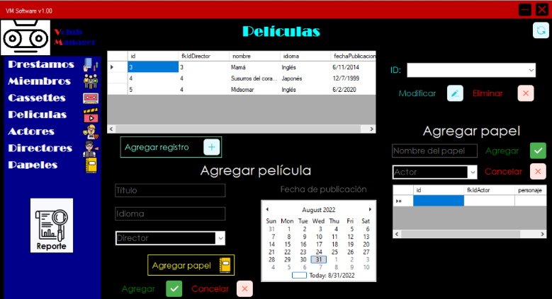

# Hello everybody!👋👋✨

My name is Julian Jara and I'm currently studying my sixth computer systems engineering semester at [TecNM Tijuana](https://www.tijuana.tecnm.mx/)💻👀. My main areas of interest are pogramming and Mathematics 📈 (there are not really a lot of emojis about math, huh?😒😤), so I'm always trying to merge these two together in my projects 🙌.

## Some of my projects and experience 🐱‍💻
In the last couple of years I've been mainly working with C#, MATLAB and SQL Server, even though I'm familiar with Python 🐍, C, MySQL, HTML and CSS. The projects I've done are mostly desktop applications for windows, like CRUD systems. Nevertheless, the last two semesters I experimented with computer graphics, numerical methods and simple simulation, I even had the oportunity to participate in a Hackathon! 🎉.   

<p align="center">
  
</p>

## What am I learning?

### My school schedule 📚📓
|    Hour    |         Monday        |       Tuesday        |       Wenesday       |       Thursday       |        Friday        |
|------------|-----------------------|----------------------|----------------------|----------------------|----------------------|
|    1:2pm   | Software engineering  | Software engineering | Software engineering | Software engineering | Software engineering |
|    2:3pm   | Computer networks     | Computer networks    | Computer networks    | Computer networks    | Software engineering |
|    3:4pm   | SOs Workshop          | SOs Workshop         | SOs Workshop         | SOs Workshop         | SOs Workshop         |
|    4:5pm   | Interface's languages | Interface languages  | Interface languages  | Interface languages  | Interface languages  |
|    5:6pm   | Automata theory       | Automata theory      | Automata theory      | Automata theory      | Automata theory      |
|    6:7pm   | Database management   | Database management  | Database management  | Database management  | Database management  |

### Side learning
I'm currently enrolled in a web development udemy course . Besides that, I'm taking the wonderful [Giberth Strang's linear algebra classes from MIT OpenCourseWare](https://www.youtube.com/watch?v=ZK3O402wf1c&list=PL49CF3715CB9EF31D&index=1).
Finally, I would like to pursue machine learning, generative graphics, bot programming and robotics 🤖 in the future.

### Código Hola mundo
```C#
//Hola Mundo, programa escrito en una computadora de Virgina, US de manera remota desde Tijuana, BC México
using System;

namespace holaMundo
{
        public class Program
        {
                static void Main(string[] args)
                {
                        Console.WriteLine("Hola Mundo!!!");
                        Console.ReadKey();
                }
        }

}
```

